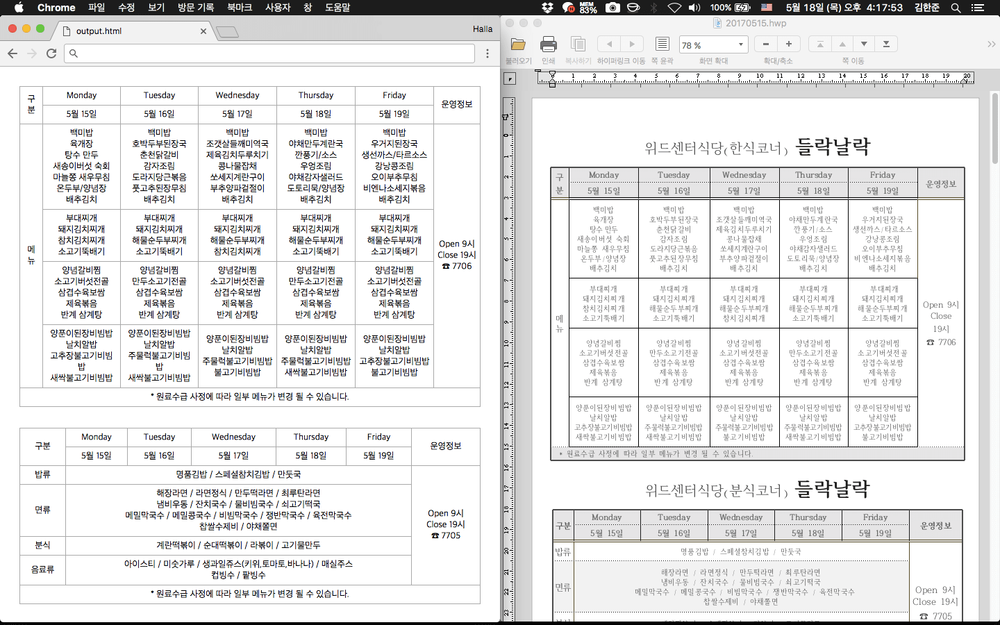

# hwp5-table-extractor

hwp5-table-extractor is a tool for extracting tables from Hwp5 file.
It is developed in Python 3.6.1.

## Screenshot



## Dependencies

- olefile
- click
- jinja2

## Usage

Currently, no installation script is provided.
Just clone this repository and install dependencies, then run it manually:

```bash
$ git clone https://github.com/hallazzang/hwp5-table-extractor.git
$ cd hwp5-table-extractor
$ virtualenv -p python3 venv
$ source venv/bin/activate
(venv) $ pip install -r requirements.txt
(venv) $ python cli.py <INPUT_FILE> <OUTPUT_FILE>
```
